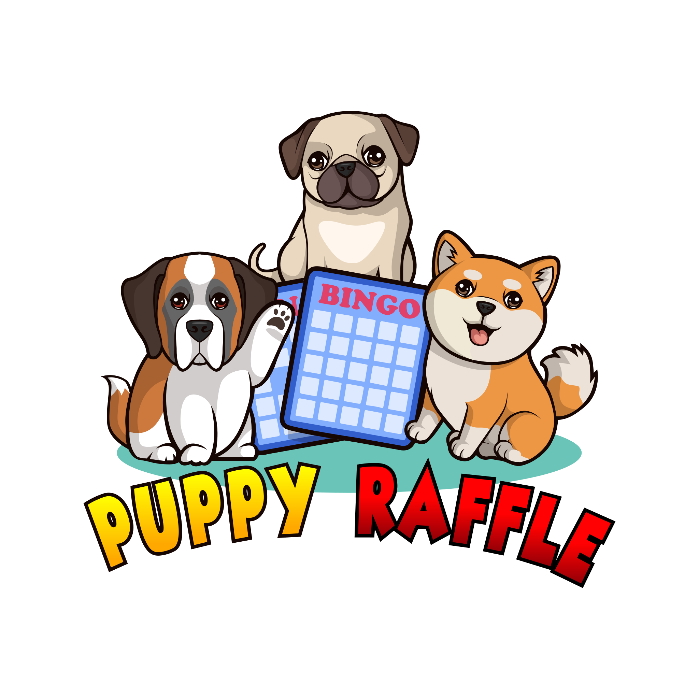

<div align="center" style="page-break-after: always;">
<p align="center">

<br/>
<h1>Puppy Raffle Report</h1>
</p>
</div>

# About Puppy Raffle.

The Puppy Raffle project is a decentralized protocol designed to host raffles for winning adorable dog NFTs. Participants can join the raffle by calling the `enterRaffle` function, which accepts an array of addresses (`address[] participants`) as input. This allows users to enter themselves multiple times or include friends as co-participants. However, duplicate addresses are not permitted, ensuring fair participation. Users who change their minds can call the `refund` function to retrieve their ticket and the associated value. At regular intervals, determined by the protocol, a winner is randomly selected and awarded a unique puppy NFT. Additionally, the protocol’s owner can designate a `feeAddress` to collect a portion of the ticket value, while the remaining funds are allocated to the raffle winner, creating a fair and engaging system for participants.

# Vulnerabilities

## **[Medium] Denial Of Service: via Inefficient Duplicate Check in `enterRaffle` Function**

### **Description**
The enterRaffle function in the Puppy Raffle contract is vulnerable to a Denial of Service (DoS) attack due to an inefficient nested loop used for detecting duplicate entries. As the `players` array grows in size, the duplicate check `(O(n^2)` complexity becomes increasingly computationally expensive. An attacker can exploit this by repeatedly calling the function with a large number of `newPlayers` entries, causing excessive gas consumption. This can result in the transaction running out of gas or becoming prohibitively expensive for legitimate users, effectively preventing others from participating in the raffle.

```javascript
function enterRaffle(address[] memory newPlayers) public payable {
        require(msg.value == entranceFee * newPlayers.length, "PuppyRaffle: Must send enough to enter raffle");
        for (uint256 i = 0; i < newPlayers.length; i++) {
            players.push(newPlayers[i]);
        }

        // Denial Of Service 
        for (uint256 i = 0; i < players.length - 1; i++) {
            for (uint256 j = i + 1; j < players.length; j++) {
                require(players[i] != players[j], "PuppyRaffle: Duplicate player");
            }
        }
        emit RaffleEnter(newPlayers);
    }
```

### **Key Risk Points:**

1. Nested Loops: The combination of two nested loops iterating over the players array makes the function's execution time scale quadratically.
2. Large Inputs: Submitting a large newPlayers array drastically increases gas consumption.
3. DoS Potential: Repeated submissions of large input can deplete the gas limit, halting the function for all users.

### **Impact**
The Denial of Service (DoS) vulnerability in the `enterRaffle` function of the PuppyRaffle smart contract can have significant consequences. Due to the quadratic complexity of checking for duplicate players, the gas costs increase exponentially with the number of participants, making it economically infeasible for smaller players to enter. 

This vulnerability enables malicious actors to flood the contract with large numbers of players, causing gas consumption to spike, effectively disabling the contract and preventing legitimate users from participating. 

Over time, this could result in a complete disruption of the raffle process, loss of user trust, and the potential for economic exploitation by attackers seeking to manipulate raffle outcomes. If left unaddressed, this issue could also cause the contract to become unusable or expire due to excessive gas costs, undermining the contract's functionality and fairness.

### **Proof of concept**

If we have 2 sets of 100 players, the gas cost will be more expensive:

1. First 100 players cost: ~6535384n
2. Second 100 players cost: ~19218960n

## **Mitigations**

1. Use a Mapping for Player Entries
    ```javascript
    mapping(address => bool) public hasEntered;
    function enterRaffle(address[] memory newPlayers) public payable {
        require(msg.value == entranceFee * newPlayers.length, "PuppyRaffle: Must send enough to enter raffle");
        for (uint256 i = 0; i < newPlayers.length; i++) {
            require(!hasEntered[newPlayers[i]], "PuppyRaffle: Duplicate player");
            hasEntered[newPlayers[i]] = true;
            players.push(newPlayers[i]);
        }
        emit RaffleEnter(newPlayers);
    }
    ```
2. Limit the participants.